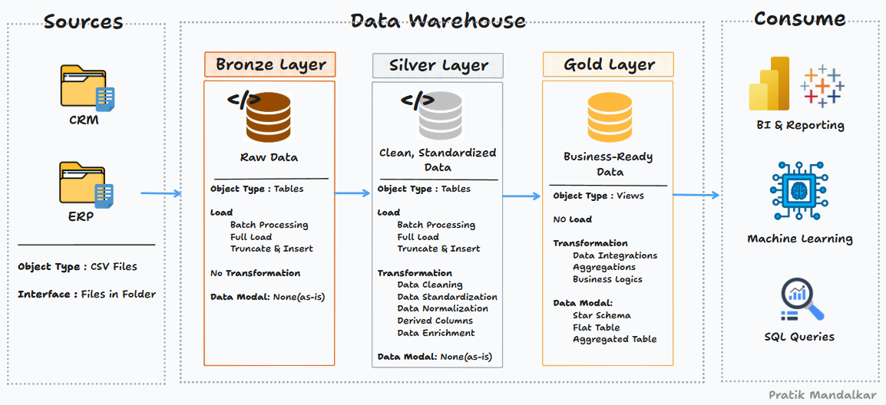

# 📊 Data Warehouse and Analytics Project

Welcome to the **Data Warehouse and Analytics Project** repository! 🚀  
This project showcases a **complete end-to-end data engineering and analytics solution** — from ingesting raw data to deriving powerful business insights.

Designed as a **portfolio project**, it reflects industry best practices in modern data warehousing, ETL pipelines, dimensional modeling, and business intelligence.

---

## 🏗️ Data Architecture: Medallion Framework

The architecture follows the **Medallion Architecture** with three data layers:



| Layer   | Description                                                                 |
|---------|-----------------------------------------------------------------------------|
| 🥉 **Bronze** | Stores raw data as-ingested from ERP and CRM systems (CSV files into SQL Server). |
| 🥈 **Silver** | Data is cleaned, standardized, and transformed for analytical readiness. |
| 🥇 **Gold**   | Business-ready, analytical data modeled in a star schema. Used for BI and reporting. |

---

## 📖 Project Highlights

This project includes:

✅ **Modern Data Architecture** — Using Medallion model (Bronze/Silver/Gold)  
✅ **ETL Pipelines** — Custom SQL scripts to extract, clean, transform, and load data  
✅ **Data Modeling** — Fact and Dimension tables for reporting  
✅ **SQL-based Analytics** — Actionable business insights into sales, products, and customers  
✅ **Dashboard & Reports** — Tailored for stakeholders and business teams

💼 **Ideal For Roles In**:
- Data Engineer  
- SQL Developer  
- Business Intelligence Analyst  
- ETL Developer  
- Data Architect  

---

## 🛠️ Tools & Resources

Everything is **100% Free & Open Source**:

| Tool                  | Purpose                                     |
|-----------------------|---------------------------------------------|
| [📂 Datasets](datasets/) | Raw ERP & CRM data in CSV format           |
| [🛢️ SQL Server Express](https://www.microsoft.com/en-us/sql-server/sql-server-downloads) | Host your DW locally                        |
| [🧰 SSMS](https://learn.microsoft.com/en-us/sql/ssms/download-sql-server-management-studio-ssms?view=sql-server-ver16) | GUI for managing SQL Server                 |
| [🧩 Draw.io](https://www.drawio.com/) | Diagrams for architecture, data flow, models |

---

## 🚀 Project Objectives

### 🛠️ **1. Data Engineering Phase**
Build a modern SQL Server-based Data Warehouse.

🔹 Import ERP & CRM CSV files  
🔹 Clean and transform data  
🔹 Build ETL pipelines using SQL  
🔹 Create star schema models (fact + dimension tables)

> ✅ *Focus on latest data only; no historization required.*

---

### 📊 **2. Business Intelligence & Reporting**
Uncover key insights through advanced SQL queries:

- 🔍 **Customer Behavior Analysis**
- 📦 **Product Performance Trends**
- 💰 **Sales & Revenue Insights**

These insights drive **data-informed decision-making**.

📄 For requirements, check: [`docs/requirements.md`](docs/requirements.md)

---

## 📂 Repository Structure
```
data-warehouse-project/
│
├── datasets/                           # Raw datasets used for the project (ERP and CRM data)
│
├── docs/                               # Project documentation and architecture details
│   ├── etl.drawio                      # Draw.io file shows all different techniquies and methods of ETL
│   ├── data_architecture.drawio        # Draw.io file shows the project's architecture
│   ├── data_catalog.md                 # Catalog of datasets, including field descriptions and metadata
│   ├── data_flow.drawio                # Draw.io file for the data flow diagram
│   ├── data_models.drawio              # Draw.io file for data models (star schema)
│   ├── naming-conventions.md           # Consistent naming guidelines for tables, columns, and files
│
├── scripts/                            # SQL scripts for ETL and transformations
│   ├── bronze/                         # Scripts for extracting and loading raw data
│   ├── silver/                         # Scripts for cleaning and transforming data
│   ├── gold/                           # Scripts for creating analytical models
│
├── tests/                              # Test scripts and quality files
│
├── README.md                           # Project overview and instructions
├── LICENSE                             # License information for the repository
├── .gitignore                          # Files and directories to be ignored by Git
└── requirements.txt                    # Dependencies and requirements for the project
```
---

## 🔐 License

This project is licensed under the [MIT License](LICENSE).  
You're free to use, modify, and share — just credit appropriately. 🙌

---

## 🌟 About Me

👋 Hey there! I'm **Pratik Mandalkar**, a tech enthusiast passionate about solving real-world problems using **Data Engineering, Analytics, and System Design**.

💼 **Connect with me:**

- 🔗 [LinkedIn](https://www.linkedin.com/in/pratik-mandalkar/)
- 🧑‍💻 [GitHub](https://github.com/Pratik3c)
- 📫 [Email](mailto:pratikmandalkar369@gmail.com)

Let’s connect, collaborate, and learn together! 🚀

---

> 🧠 _“Data is the new oil, but insight is the spark that sets it on fire.”_

